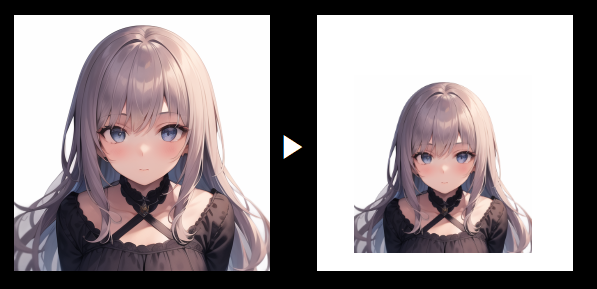

# head-center-crop
Creates a head-centered image from an image with a head.

In detail, it detects a head from the input image, crops the head, and centers the head on new image.

Accepts two head types:

* Human head
* Anime character head



## Prerequisite
This library depends on `anime-face-detector` and `face_recognition`.
* [anime-face-detector](https://github.com/hysts/anime-face-detector)
* [face_recognition](https://github.com/ageitgey/face_recognition)

Please install those libraries before usage.

Following is the script that I used for setup:
```bash
apt install cmake

conda create -n head python=3.9
conda install openmim
conda install pytorch==1.12.1 torchvision==0.13.1 torchaudio==0.12.1 cudatoolkit=11.3 -c pytorch
conda install tqdm

pip install mmcv-full==1.6.2 -f https://download.openmmlab.com/mmcv/dist/cu113/torch1.12/index.html
pip install mmdet==2.28.2 mmpose==0.29.0
pip install anime-face-detector

conda install dlib
pip install face_recognition
```

## HeadCenterCrop
### constructors
* `HeadCenterCrop(self, detector: HeadDetector, output_size: Tuple[int, int]=(256, 256), target_size: Tuple[float, float]=(0.5, 0.5)))`:   
  The Base class for crop. Use the child classes instead of this class.
    * `detector`: `HeadDetector`
    * `output_size`: The size of the result image. (width, height)
    * `target_size`: The ratio of head in the result image. (width, height)

* `HumanCenterCrop(self, margin_x: Tuple[int, int]=(0.2, 0.2), margin_y: Tuple[int, int]=(0.5, 0), **kwargs)`:  
    Accepts human images as input.
    * `margin_x`, `margin_y`: margin for face area detected by a face detector. 

* `AnimeCenterCrop(self, margin_x: Tuple[int, int]=(0.5, 0.5), margin_y: Tuple[int, int]=(1, 0), **kwargs)`:  
    Accepts anime images as input.
    * same as `HumanCenterCrop`


### Functions
* `crop_image(self, file: str, save_path: str) -> bool`  
crop specified file and save it.
  * `file`: Path to input file
  * `save_path`: Path to output file

* `resize(self, image: np.ndarray, manual_area: np.ndarray=None, use_bgr: bool=False) -> np.ndarray`  
crop specified image and return it.
  * `image`: an input image. Expected shape: (W, H, C)
  * `manual_area`: if specified, it does not detect the face but use the specified area. [x1, y1, x2, y2]
  * `use_bgr`: if True, the input image is regarded as BGR format.

## Example
### Human Head Crop

```python
from head_center_crop import HumanHeadCenterCrop

input_image = 'input.png'
result_path = 'result.png'

human_crop = HumanHeadCenterCrop(output_size=(224, 224))
human_crop.crop_image(input_image, result_path)
```


### Anime Head Crop
```python
from head_center_crop import AnimeHeadCenterCrop

input_image = 'input.png'
result_path = 'result.png'

anime_crop = AnimeHeadCenterCrop(margin_x=(0.4, 0.4))
anime_crop.crop_image(input_image, result_path)
```

